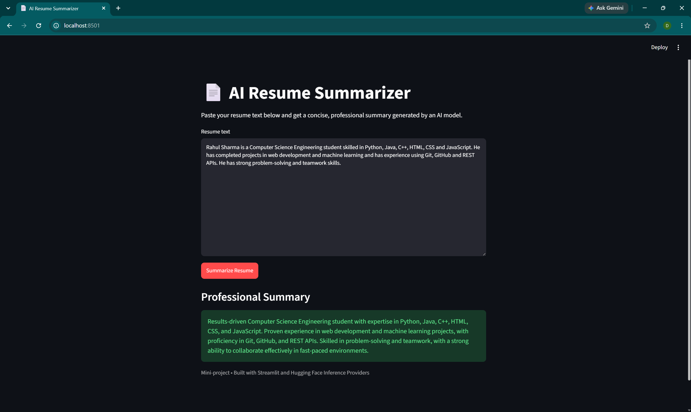
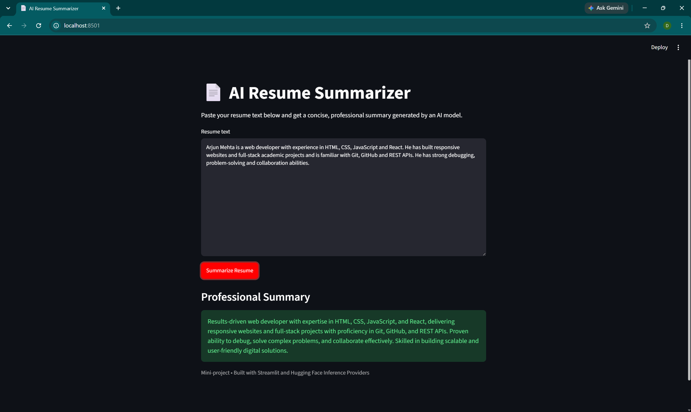
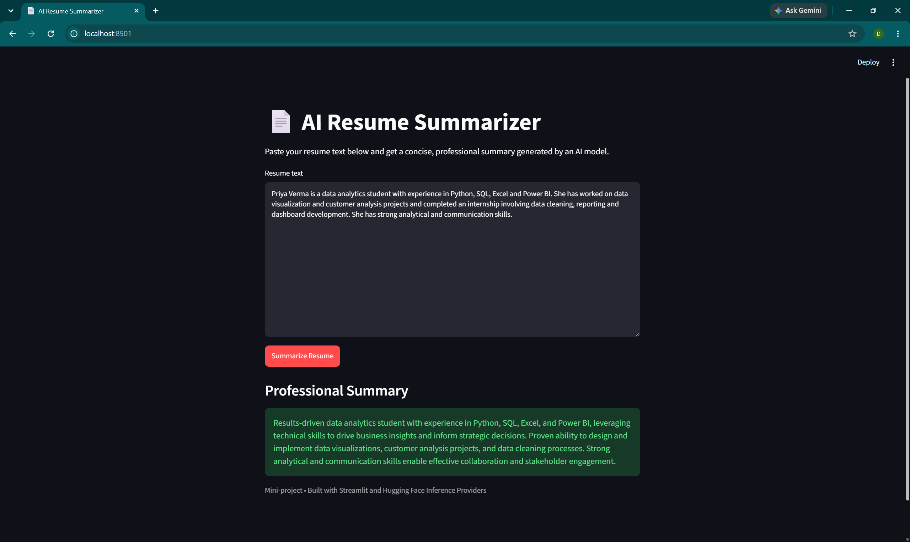

# AI Resume Summarizer

A minimal Streamlit web app that turns pasted resume text into a concise,
professional 2–3 line summary using a Hugging Face model.

## 🔗 Live Demo
**[https://resume-summarizer.streamlit.app/](https://resume-summarizer.streamlit.app/)**

## Objective
Build a simple, clean web app that takes raw resume text and generates a
concise professional summary, demonstrating practical use of the
`huggingface_hub` package and Hugging Face Inference Providers within a
Streamlit interface. The project is designed to use Hugging Face's
available free-tier inference usage.

## What the App Does
- Accepts resume text pasted into a large text area.
- On clicking **Summarize Resume**, validates the input length.
- Sends the text to a Hugging Face instruction-following model with a
  summarization prompt.
- Displays a professional 2–3 sentence summary covering the candidate's
  background, key skills, experience/projects, and strengths.

## Tech Stack
- **Language:** Python 3.9+
- **UI:** Streamlit
- **AI:** `huggingface_hub` `InferenceClient` via Hugging Face Inference
  Providers
- **Model:** `meta-llama/Llama-3.1-8B-Instruct`

## Workflow
1. User pastes resume text into the text area.
2. User clicks **Summarize Resume**.
3. App validates input (not empty, 50–12000 characters).
4. App reads `HUGGINGFACEHUB_API_TOKEN` from an environment variable
   (local) or `st.secrets` (deployed).
5. App calls the Hugging Face model with a strict summarization prompt.
6. Model returns a short summary.
7. Summary is shown on the page; errors are shown as friendly messages.

## Implementation Details
- **`app.py`** contains the whole app (~115 lines):
  - `get_api_token()` — reads the token from `os.environ` first, then falls
    back to `st.secrets`. The token is never hardcoded.
  - Constants `MODEL`, `MIN_CHARS` (50), `MAX_CHARS` (12000).
  - `summarize_resume(resume_text, api_token)` — builds the prompt, creates
    an `InferenceClient`, and calls `chat_completion` with
    `max_tokens=200` and `temperature=0.3` for stable, short output.
  - UI section: `st.set_page_config`, title, description, `st.text_area`,
    and a `st.button` that triggers validation → API call → display.
  - Validation branches handle empty / too short / too long input.
  - Error handling: `HfHubHTTPError` for API errors and a generic
    `except Exception` for anything else, both surfaced via `st.error`.
- **Prompt design:** instructs the model to return exactly 2–3 sentences,
  under ~75 words, as plain prose with no headings, bullets, intro phrases
  ("Here is a summary"), or trailing commentary.
- **Dependencies:** only `streamlit` and `huggingface_hub`
  (see `requirements.txt`). No LangChain, database, auth, or PDF parsing.

## Screenshots

### Screenshot 1


### Screenshot 2


### Screenshot 3


## Hugging Face Usage
- Create a free account at <https://huggingface.co>.
- Generate a token at <https://huggingface.co/settings/tokens>. Use a
  fine-grained token with permission to **make calls to Inference
  Providers**.
- The app passes this token to `InferenceClient(api_key=...)`, which routes
  the request through Hugging Face Inference Providers to the model.
- The project is designed to use Hugging Face's available free-tier
  inference usage.

## How to Run Locally
1. (Optional) Create and activate a virtual environment.
2. Install dependencies:
   ```bash
   pip install -r requirements.txt
   ```
3. Set your token:

   **Windows (PowerShell)**
   ```bash
   $env:HUGGINGFACEHUB_API_TOKEN="your_token_here"
   ```
   **macOS / Linux**
   ```bash
   export HUGGINGFACEHUB_API_TOKEN="your_token_here"
   ```
4. Run the app:
   ```bash
   streamlit run app.py
   ```
5. Open the URL shown in the terminal (usually <http://localhost:8501>).

## How Deployment Works (Streamlit Community Cloud)
1. Push this project to a public GitHub repository.
2. On <https://share.streamlit.io>, create a new app from the repo with
   `app.py` as the entry point.
3. In **App settings → Secrets**, add:
   ```toml
   HUGGINGFACEHUB_API_TOKEN = "your_token_here"
   ```
4. Deploy. Streamlit installs `requirements.txt` and runs `app.py`. The
   app reads the token from `st.secrets`, so no code change is needed
   between local and deployed environments.

## Notes
- The API token is never stored in the source code.
- No OpenAI dependency — uses Hugging Face Inference Providers.
